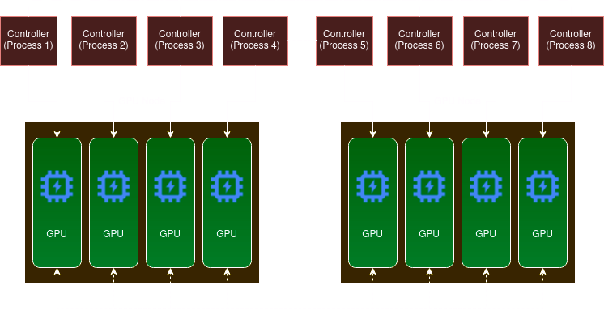

# 1. introduction

In this tutorial, I will give a quick guide on distributed computing with JAX on the JeanZay supercalculator. We focus on the multi-controller model, a crucial concept for leveraging JAX's full potential on high-performance computing systems. This guide is tailored for users aiming to optimize their JAX applications for environments like JeanZay, where efficient distribution across multiple controllers is essential.

In JAX, each process runs independently in what's known as a Single Program, Multiple Data (SPMD) model. This differs from traditional distributed systems where a single node controls multiple workers. Each process runs a slightly varied version of the same Python program. For instance, different processes may handle distinct data segments. However, JAX requires manual execution on each host; it does not support automatic multi-process initiation from a single command.

When executing JAX code on a single machine, particularly with multiple GPUs, certain considerations and configurations are necessary. This section will guide you through setting up a single host with multiple GPUs.

---
1. <span style="font-size: 26px;">Table of content</span>
---

- [1. introduction](#1-introduction)
- [2. Data layout and memory allocation in distributed computing](#2-data-layout-and-memory-allocation-in-distributed-computing)
- [3. Launching on HPC](#3-launching-on-hpc)
  - [3.1. Single Controller case (single node)](#31-single-controller-case-single-node)
  - [3.2. Multi controller](#32-multi-controller)
  - [3.3. Simulating on CPU](#33-simulating-on-cpu)
  - [3.4. Single controller for multiple devices](#34-single-controller-for-multiple-devices)
  - [3.5. Multi controller for multiple nodes](#35-multi-controller-for-multiple-nodes)
  - [3.6. A single Controller per GPU](#36-a-single-controller-per-gpu)
- [4. Understanding Sharding in JAX](#4-understanding-sharding-in-jax)
  - [4.1. Sharding Properties](#41-sharding-properties)
  - [4.2. Special Kinds of Shards](#42-special-kinds-of-shards)
- [5. Loading and efficiently distruting data using shardings](#5-loading-and-efficiently-distruting-data-using-shardings)
  - [5.1. on Single host multi GPU](#51-on-single-host-multi-gpu)
    - [5.1.1. Example](#511-example)
  - [5.2. Multiple controller (one GPU per controller)](#52-multiple-controller-one-gpu-per-controller)
    - [5.2.1. Example](#521-example)
  - [5.3. Classic PositionalSharding in Multi-controller setup](#53-classic-positionalsharding-in-multi-controller-setup)
  - [5.4. Reshaping a GlobalDeviceShard](#54-reshaping-a-globaldeviceshard)
  - [5.5. global\_shards vs addressable\_shards](#55-global_shards-vs-addressable_shards)
  - [5.6. Getting the shape of the data](#56-getting-the-shape-of-the-data)
- [6. Loading data from a single source to multiple controller devices](#6-loading-data-from-a-single-source-to-multiple-controller-devices)
- [7. Collective communications](#7-collective-communications)

# 2. Data layout and memory allocation in distributed computing

Before diving any deeper, I will illustrate different types of memory allocation management in distributed computing and how JAX uses different distribution techniques for inter-GPU communications or collectives.

If you don't know what collectives mean I highly suggest [this wikipedia page](https://en.wikipedia.org/wiki/Collective_operation) and this [NCCL tutorial](https://docs.nvidia.com/deeplearning/nccl/archives/nccl_2183/user-guide/docs/usage/collectives.html#)

# 3. Launching on HPC

## 3.1. Single Controller case (single node)

First we need to set up our `.slurm` script, you can find it [here](slurms/slurms/01-single-host-8-GPUs.slurm)

The most important arguments are
```
#SBATCH --nodes=1
#SBATCH --ntasks=1
#SBATCH --ntasks-per-node=1
#SBATCH --gres=gpu:4
```

This is for a v100 for example, check your HPC documentations for mode details


`nodes`, `ntasks` and `ntasks-per-node` are redundant together only one of `nodes`, `ntasks` is required.\
But notice here that I used only one task for 4 GPUs

## 3.2. Multi controller

Just like [Single host multi GPU](#single-host-multi-gpu) we need to set up our `.slurm` script, you can find it [here](slurms/02-multihost-2nodes.slurm)

The most important arguments are
```
#SBATCH --nodes=2
#SBATCH --ntasks=8
#SBATCH --ntasks-per-node=4
#SBATCH --gres=gpu:4
```
Notice that we still allocate 4 GPUs but there are 4 GPUs per node. In total we have 8.

## 3.3. Simulating on CPU

If you don't have access to multi GPU and/or multi node setup you can simulate anything in this tutorial on CPU (except [7. Collective communications](#7-collective-communications)).

First make sure that you have `mpi` (cuda aware or not) and the `jax` cpu variant

```bash
pip install --upgrade pip
CFLAGS=-noswitcherror pip install mpi4py
pip install --upgrade "jax[cpu]"
```

`CFLAGS=-noswitcherror` is necessary if your compiler is NVIDIA's `nvc` or `nvc++` instead of `gcc` or `g++` respectively (`echo $CC && echo $CXX` to check).

Next check how many CPU core you have using `nproc` (for linux), this is how many *fake nodes* you can simulate.

Next use this to tell XLA to treat multiple cpu threads as if they where multiple devices (in this example each *node* has 8 devices)

```bash
export XLA_FLAGS='--xla_force_host_platform_device_count=8'
```

Then you can launch for 8 nodes like this

```bash
mpirun -np 8 python script.py
```
In this case we simulate 8 times 8 devices = 64 for example

__note:__ pmaped collectives do not work on cpu


## 3.4. Single controller for multiple devices

This is the case in normal (not distributed) jax, having multiple GPUs connected via PCI, NVLink, NVSwitch etc ...\
jax *address* the GPUs as a single controller.

You can see available devices by:

```python
import jax
jax.devices()
#out : [cuda(id=0),cuda(id=1),cuda(id=2),cuda(id=3)]
```
Whenever you call any jax array API (using `jax.numpy` functions or `jax.random.normal` for example) you allocate some memory on the accelerator (or device for simplicity) which could be a GPU or TPU, and it is allocated on the default (the first) device in the `jax.device()` list. For example in a multi GPU setup the device would be `cuda(id=0)`

```python
a = jax.random.normal(jax.random.PRNGKey(0), (5,5))
a.devices()
#out : [cuda(id=0)]
```
You can *address* any other GPU in the list using jax.device_put

```python
b = jax.device_put(a , jax.devices()[2])
#out : [cuda(id=2)]
```

Here is a diagram of what single controller looks like

<div align="center">
    
</div>


\
__note:__ JAX is always multi-controller from what I understood, but for simplicity I will call it single controller when there is one process launched by the end user (that's you) even if JAX launches multiple processes under the hood.

## 3.5. Multi controller for multiple nodes 

Think of a node as a personal computer. You have multiple components, multiple RAM slots, multiple PCIe lanes but one motherboard and one case (generally).

One motherboard can take a finite amount of GPUs because it has a finite amount of PCIe x16 lanes, for example. If you want to go further and use multiple GPUs from multiple machines, you can no longer use only one controller. In HPC and in supercomputers, we call that having multiple nodes.

Check how many nodes does [Jean-Zay](http://www.idris.fr/jean-zay/cpu/jean-zay-cpu-hw.html) or [Perlmutter](https://docs.nersc.gov/systems/perlmutter/architecture/#system-specifications) have for example.

If we wanna do jax on 2 nodes and beyond, we have to use multi controller setup, using `mpirun` or `srun` and specifying the exact architecture we are targeting.

In this case here is what a single controller setup (process) looks like :

<div align="center">
    
</div>

we can do this for example by calling `mpiexec -np 2 python some_script.py`.

The most important thing to note is that, unlike what we have in a single controller setup, each line is executed `n` times where `n` is the number of controllers. This means that in a setup similar to what we have in the diagram, we will get this.

```python
import jax
print(jax.devices())
#out : [cuda(id=0),cuda(id=1),cuda(id=2),cuda(id=3)]
#out : [cuda(id=0),cuda(id=1),cuda(id=2),cuda(id=3)]
```
We get the same output twice (for each process) of 4 GPUs. In fact, the line `print(jax.devices())` was executed twice, and `cuda(id=0)` is not the same GPU as `cuda(id=0)` in the second line.

We need to call `jax.distributed.initialize()` in order to notify JAX that we will be handling the distribution.\
Check a simple (but not very rich) guide on multi-host JAX environment at [jax.readthedocs.io](https://jax.readthedocs.io/en/latest/multi_process.html).

```python
import jax
jax.distributed.initialize()
print(jax.devices())
print(jax.local_devices())
#out : [cuda(id=0), cuda(id=1), cuda(id=2), cuda(id=3), cuda(id=4), cuda(id=5), cuda(id=6), cuda(id=7)]
#out : [cuda(id=0), cuda(id=1), cuda(id=2), cuda(id=3)]
#out : [cuda(id=0), cuda(id=1), cuda(id=2), cuda(id=3), [cuda(id=4), cuda(id=5), cuda(id=6), cuda(id=7)]
#out : [cuda(id=4), cuda(id=5), cuda(id=6), cuda(id=7)]
```

This makes more sense, now we print these two lines two times for each process.\
We say that each node sees that there are 4 other GPUs in the other node, and the second one knows that its default GPU is called `cuda(id=5)` instead of `cuda(id=0)`.\
Each node process can *address* its four GPUs but not the others, so they are not *addressable* to it.\
In the previous diagram, solid lines represent *addressable* devices, and dotted lines represent *non-addressable* devices.

__note:__ when using `mpi` or `srun` you don't need to assign an ip address, you can just call the function with no arguments

For more readability I suggest doing these : 

```python
print(f"Process {jax.process_index()} global devices : {jax.devices()}")
print(f"Process {jax.process_index()} local devices : {jax.local_devices()}")
#out : Process 0 global devices : [cuda(id=0), cuda(id=1), cuda(id=2), cuda(id=3), cuda(id=4), cuda(id=5), cuda(id=6), cuda(id=7)]
#out : Process 1 global devices : [cuda(id=0), cuda(id=1), cuda(id=2), cuda(id=3), cuda(id=4), cuda(id=5), cuda(id=6), cuda(id=7)]
#out : Process 1 local devices : [cuda(id=4), cuda(id=5), cuda(id=6), cuda(id=7)]
#out : Process 0 local devices : [cuda(id=0), cuda(id=1), cuda(id=2), cuda(id=3)]

```

__Note:__ order is never guaranteed in multi controller calls, the only way to ensure that two steps do not interfere with each other is by using [sync_global_devices](https://jax.readthedocs.io/en/latest/_autosummary/jax.experimental.multihost_utils.sync_global_devices.html#jax.experimental.multihost_utils.sync_global_devices) which is similar to `MPI_Barrier` for those who are familiar with MPI, on CPU `sync_global_devices` does not work, you have to use [comm.Barrier()](https://mpi4py.readthedocs.io/en/stable/reference/mpi4py.MPI.Comm.html?highlight=barrier#mpi4py.MPI.Comm.barrier)


## 3.6. A single Controller per GPU

For maximum scalability, we would start a process per GPU (check the Slurm scripts for more info on how to do this).

This is the diagram: 

<div align="center">
    
</div>

Again dotted lines represent *non-addresable* devices

If we do the same thing again but by doing this `mpirun -np 8 python script.py`

```python
import jax
jax.distributed.initialize()

if jax.process_index() == 0:
    print(f"global devices : {jax.devices()}")
print(f"Process {jax.process_index()} local devices : {jax.local_devices()}")

#out : global devices : [cuda(id=0), cuda(id=1), cuda(id=2), cuda(id=3), cuda(id=4), cuda(id=5), cuda(id=6), cuda(id=7)]
#out : Process 0 local devices : [cuda(id=0)]
#out : Process 5 local devices : [cuda(id=5)]
#out : Process 1 local devices : [cuda(id=1)]
#out : Process 4 local devices : [cuda(id=4)]
#out : Process 3 local devices : [cuda(id=3)]
#out : Process 2 local devices : [cuda(id=2)]
#out : Process 7 local devices : [cuda(id=7)]
#out : Process 6 local devices : [cuda(id=6)]

```

Next we will learn how to efficiently distribute data on any set up and use collective communications

# 4. Understanding Sharding in JAX

Sharding in JAX refers to how data is distributed across different devices in a multi-gpu environment. It's essential to comprehend the properties and types of sharding available in JAX to utilize the hardware efficiently.\
It basically descibes how is the data split on multiple devices and it tells [Lax collectives](https://jax.readthedocs.io/en/latest/jax.lax.html#parallel-operators) how and where to look for data on other devices.


## 4.1. Sharding Properties


1. [addressable_devices](https://jax.readthedocs.io/en/latest/jax.sharding.html#jax.sharding.Sharding.addressable_devices): Represents the group of devices that this sharding can address. For a single controller setup, all devices are always addressable. For a single controller per GPU, only one device is addressable by default for each sharding on each process.
2. [device_set](https://jax.readthedocs.io/en/latest/jax.sharding.html#jax.sharding.Sharding.device_set): Represents the group of devices spanned by a specific sharding. In a multi-controller environment, this set includes devices that may not be directly addressable by the current process. For a single controller, this will always be equivalent to `addressable_devices`.
3. [is_fully_addressable](https://jax.readthedocs.io/en/latest/jax.sharding.html#jax.sharding.Sharding.is_fully_addressable): Indicates whether all devices named in the Sharding are accessible by the current process. This property is analogous to `is_local` in a multi-process JAX setup.
4. [is_fully_replicated](https://jax.readthedocs.io/en/latest/jax.sharding.html#jax.sharding.SingleDeviceSharding.is_fully_replicated): Determines if each device holds a complete copy of the entire data. A sharding is fully replicated when this condition is met.


## 4.2. Special Kinds of Shards

- [SingleDeviceSharding](https://jax.readthedocs.io/en/latest/jax.sharding.html#jax.sharding.SingleDeviceSharding): Data is placed on a single device (the default case where we place an entire copy of the data on GPU0).
- [PositionalSharding](https://jax.readthedocs.io/en/latest/jax.sharding.html#jax.sharding.PositionalSharding): Uses device positioning for data distribution.

```python
sharding = PositionalSharding(mesh_utils.create_device_mesh((8,)))
```

You can find a detailed [example here](https://jax.readthedocs.io/en/latest/notebooks/Distributed_arrays_and_automatic_parallelization.html#intro-and-a-quick-example) 


- [NamedSharding](https://jax.readthedocs.io/en/latest/jax.sharding.html#jax.sharding.NamedSharding): Employs named axes to express sharding.

```python
mesh = Mesh(np.array(jax.devices()).reshape(2, 4), ('x', 'y'))
spec = P('x', 'y')
named_sharding = jax.sharding.NamedSharding(mesh, spec)
```
You can find a detailed [example here ](https://jax.readthedocs.io/en/latest/notebooks/Distributed_arrays_and_automatic_parallelization.html#namedsharding-gives-a-way-to-express-shardings-with-names)

- [PmapSharding](https://jax.readthedocs.io/en/latest/jax.sharding.html#jax.sharding.PmapSharding): Matches the default placement used by jax.pmap(), it is the output of a pmapped function basically in case of multi controller `pmap` it returns this sharding by default after using a collective.
- [GSPMDSharding](https://jax.readthedocs.io/en/latest/jax.sharding.html#jax.sharding.GSPMDSharding): Considers a global set of devices, including those not directly addressable in a multi-controller setup we will see an example of this later on.

# 5. Loading and efficiently distruting data using shardings

In this part, we will discuss how we can put our data in one or multiple devices according to data-specific or algorithm-specific layouts.

## 5.1. on Single host multi GPU

Refer to [Distributed arrays and automatic parallelization](https://jax.readthedocs.io/en/latest/notebooks/Distributed_arrays_and_automatic_parallelization.html#) for detailed guidance.

### 5.1.1. Example

This is the example from https://jax.readthedocs.io

```python
from jax.experimental import mesh_utils
from jax.sharding import PositionalSharding

# Create a Sharding object to distribute a value across devices:
sharding = PositionalSharding(mesh_utils.create_device_mesh((4,)))

# Create an array of random values:
x = jax.random.normal(jax.random.PRNGKey(0), (4096, 4096))
jax.debug.visualize_array_sharding(y)
```

We can see how trivial it is to change the sharding shape to fit different distribution needs.\
Let's visualize the sharding of `x` we call `jax.debug.visualize_array_sharding(x)` and get.


```
┌───────────────────────┐
│                       │
│                       │
│                       │
│                       │
│         GPU 0         │
│                       │
│                       │
│                       │
│                       │
└───────────────────────┘
```

Which makes sense, in a single controller multi device, when we allocate anything, it is sent to the main GPU (the first one).

```python
y = jax.device_put(x, sharding.reshape(2, 2))
jax.debug.visualize_array_sharding(y)
```

We get the reshaped sharding accordingly 

```
┌──────────┬──────────┐
│          │          │
│  GPU 0   │  GPU 1   │
│          │          │
│          │          │
├──────────┼──────────┤
│          │          │
│  GPU 2   │  GPU 3   │
│          │          │
│          │          │
└──────────┴──────────┘
```

Then subsequently these two reshapes

```python
x = jax.device_put(x, sharding.reshape(1,4))
jax.debug.visualize_array_sharding(x)


x = jax.device_put(x, sharding.reshape(4, 1))
jax.debug.visualize_array_sharding(x)
```
produces these shardings

```
┌───────┬───────┬───────┬───────┐
│       │       │       │       │
│       │       │       │       │
│       │       │       │       │
│       │       │       │       │
│ GPU 0 │ GPU 1 │ GPU 2 │ GPU 3 │
│       │       │       │       │
│       │       │       │       │
│       │       │       │       │
│       │       │       │       │
└───────┴───────┴───────┴───────┘
┌───────────────────────┐
│         GPU 0         │
├───────────────────────┤
│         GPU 1         │
├───────────────────────┤
│         GPU 2         │
├───────────────────────┤
│         GPU 3         │
└───────────────────────┘
```

## 5.2. Multiple controller (one GPU per controller)

Single controller means single node, which means it is not scalable. For JeanZay, for example, a V100 has quad-core GPUs and the A100 partition has octo-core. This means that if we want to do anything on more than 8 GPUs, this [example](#511-example) won't work.


### 5.2.1. Example

To begin we need to call this before doing any computation with jax 

```python
jax.distributed.initialize()
```

if curr_id == 0:
    print("A very important change is the fact that every single line of code is being ran 8 times (in our case) in the previous case we had one controller, so every line ran once except for the `pmaped` function of course because `pmap` is an implicit parallel call")

```python
curr_id = jax.process_index()
if curr_id == 0:
    print(f"Total number of devices {jax.device_count()}")
```

Now if we create any jax array types just like before 


```python
xs = jax.numpy.ones(jax.local_device_count())
jax.debug.visualize_array_sharding(xs)
```

When we visualize the shardings we see the sharding layout 8 times for each gpus like so :

```
┌───────────────┐
│     GPU 1     │
└───────────────┘
┌───────────────┐
│     GPU 0     │
└───────────────┘
┌───────────────┐
│     GPU 3     │
└───────────────┘
┌───────────────┐
│     GPU 2     │
└───────────────┘
┌───────────────┐
│     GPU 7     │
└───────────────┘
┌───────────────┐
│     GPU 6     │
└───────────────┘
┌───────────────┐
│     GPU 4     │
└───────────────┘
┌───────────────┐
│     GPU 5     │
└───────────────┘
```

If we check if the sharding is addressable we get `True`, our 8 part arrays are also `fully_replicated` which we mentioned in [Sharding Properties](#sharding-properties) which means that each device has a complete copy of the entire data, but in our case, the global data is split among 8 devices. So what is really happening.

In case of multi-controller, each code is called `n` times as we mentioned before, so this line 

```python
xs = jax.numpy.ones(jax.local_device_count())

try:
    sharding = PositionalSharding(mesh_utils.create_device_mesh((jax.device_count(),)))
    # Create an array of random values:
    x = jax.random.normal(jax.random.PRNGKey(0), (4096, 4096))
    jax.debug.visualize_array_sharding(x)
    multihost_utils.sync_global_devices("sync")
    # and use jax.make_array_from_single_device_arrays to distribute it across devices:
    y = jax.make_array_from_single_device_arrays(x, sharding.reshape(4, 2))
    #jax.debug.visualize_array_sharding(y)
except Exception as e:
    print(f"PositionalSharding error: {e}")
```

## 5.3. Classic PositionalSharding in Multi-controller setup

```python
try:
    sharding = PositionalSharding(mesh_utils.create_device_mesh((jax.device_count(),)))
    # Create an array of random values:
    x = jax.random.normal(jax.random.PRNGKey(0), (4096, 4096))
    jax.debug.visualize_array_sharding(x)
    multihost_utils.sync_global_devices("sync")
    # and use jax.device_put to distribute it across devices:
    y = jax.device_put(x, sharding.reshape(4, 2))
    #jax.debug.visualize_array_sharding(y)
except Exception as e:
    print(f"PositionalSharding error: {e}")
```

Does not work and it produces this error 


```
PositionalSharding error: device_put's second argument must be a Device or a Sharding which represents addressable devices, but got PositionalSharding([[{GPU 0} {GPU 1}]
                    [{GPU 2} {GPU 3}]
                    [{GPU 4} {GPU 5}]
                    [{GPU 6} {GPU 7}]]). You are probably trying to use device_put in multi-controller JAX which is not supported. Please use jax.make_array_from_single_device_arrays API or pass device or Sharding which represents addressable devices.
```

This means that each device can do reshaping, but for it's addressable shards only, in our case we have 8 GPUs 8 process which means we have only SingleDeviceShard, we can't reshape a scaler.

the error from the jax team suggested to do [make_array_from_single_device_arrays](https://jax.readthedocs.io/en/latest/_autosummary/jax.make_array_from_single_device_arrays.html)

Following their example : 


```python
import math
from jax.sharding import Mesh
from jax.sharding import PartitionSpec as P
import numpy as np

mesh_rows = 2
mesh_cols =  jax.device_count() // 2

global_shape = (8, 8)
mesh = Mesh(np.array(jax.devices()).reshape(mesh_rows, mesh_cols), ('x', 'y'))
sharding = jax.sharding.NamedSharding(mesh, P('x', 'y'))
inp_data = np.arange(math.prod(global_shape)).reshape(global_shape)

arrays = [
   jax.device_put(inp_data[index], d)
       for d, index in sharding.addressable_devices_indices_map(global_shape).items()]

arr = jax.make_array_from_single_device_arrays(global_shape, sharding, arrays)
assert arr.shape == (8,8) # arr.shape is (8,8) regardless of jax.device_count()
```

We see that we can load the entire data to the CPU before dispatching it according to the suggested sharding to the gpus.\
This is a bottleneck for scallability as it suggests that our data can fit on CPU memory or RAM.

Plus, it suggests using `device_put` can be used on adressable devices only which is not multi controller compatible

A different approach would be to try to recombine the SingleDeviceShards to get the full picture, this is done using this code


```python
global_mesh = jax.sharding.Mesh(jax.devices(), 'x')
pspecs = jax.sharding.PartitionSpec('x')
host_id = jax.process_index()
arr = multihost_utils.host_local_array_to_global_array(xs, global_mesh, pspecs)
```

If we visualize the array sharding, we see this 8 times : 


```
┌───────┬───────┬───────┬───────┬───────┬───────┬───────┬───────┐
│ GPU 0 │ GPU 1 │ GPU 2 │ GPU 3 │ GPU 4 │ GPU 5 │ GPU 6 │ GPU 7 │
└───────┴───────┴───────┴───────┴───────┴───────┴───────┴───────┘
```

Now this makes sense, this array is also not fully_addressable nor fully_replicable, which means that in term of memory layout we did nothing, we only mapped the position of other shards for all controllers.\
But that does not mean that we can access them, the only way to do stuff to non adressable shards is via [lax collectives](https://jax.readthedocs.io/en/latest/jax.lax.html#parallel-operators) 

If we try to print the array we get this error :

```
Print global array error: Fetching value for `jax.Array` that spans non-addressable devices is not possible. You can use `jax.experimental.multihost_utils.process_allgather` for this use case.
```

Makes sense, since the code is called locally 8 times, and none of the 8 processes can see the other shards unless a communication is established via a collective call.

We can follow the advice of the JAX team and use `process_allgather`

```python
arr_gathered = multihost_utils.process_allgather(arr)
print(f"Process {curr_id} : Gathered Global array value is {arr_gathered}")
```

This works, but if we check the type of the `arr_gathered` it is a numpy (thus cpu) array.\
In general printing the `GlobalDeviceShard` does not make sense anyway

## 5.4. Reshaping a GlobalDeviceShard

If we want to do a special kind of layout for pencil distribution for example like so 

```python
devices = mesh_utils.create_device_mesh((4,2))
mesh = Mesh(devices, axis_names=('a', 'b'))
pspecs = PartitionSpec('a', 'b')
arr4_2 = multihost_utils.host_local_array_to_global_array(xs, mesh, pspecs)
```

Just make sure that your array is divisible by b for example :

```python
x = jax.random.normal(jax.random.PRNGKey(0), (8192, 8192))
```

If we visualize we will see this for each device :

```
┌───────┬───────┐
│ GPU 0 │ GPU 1 │
├───────┼───────┤
│ GPU 2 │ GPU 3 │
├───────┼───────┤
│ GPU 4 │ GPU 5 │
├───────┼───────┤
│ GPU 6 │ GPU 7 │
└───────┴───────┘
```

We can easily transpose and change the sharding shape (given that the dimension are divisible by the new shape)


```python
pspecs2_4 = PartitionSpec('b', 'a')
arr2_4= multihost_utils.host_local_array_to_global_array(xs, mesh, pspecs2_4)
```
This is the vizualisation

```
┌──────────┬──────────┬──────────┬──────────┐
│          │          │          │          │
│  GPU 0   │  GPU 2   │  GPU 4   │  GPU 6   │
│          │          │          │          │
│          │          │          │          │
├──────────┼──────────┼──────────┼──────────┤
│          │          │          │          │
│  GPU 1   │  GPU 3   │  GPU 5   │  GPU 7   │
│          │          │          │          │
│          │          │          │          │
└──────────┴──────────┴──────────┴──────────┘
```


## 5.5. global_shards vs addressable_shards

Each Jax array (starting from jaxv0.4) has a list of `global_shards` and a list of `addressable_shards`.\
As you might guess `global_shards` is equivalent to `addressable_shards` in a single controller setup

Following with our example 

```python
global_shards : 
[
  - Shard(device=cuda(id=3), index=(slice(384, 512, None), slice(None, None, None)), replica_id=0, data=None), 
  - Shard(device=cuda(id=7), index=(slice(896, 1024, None), slice(None, None, None)), replica_id=0, data=None), 
  - Shard(device=cuda(id=1), index=(slice(128, 256, None), slice(None, None, None)), replica_id=0, data=[[...]]), 
  - Shard(device=cuda(id=6), index=(slice(768, 896, None), slice(None, None, None)), replica_id=0, data=None), 
  - Shard(device=cuda(id=0), index=(slice(0, 128, None), slice(None, None, None)), replica_id=0, data=None), 
  - Shard(device=cuda(id=4), index=(slice(512, 640, None), slice(None, None, None)), replica_id=0, data=None), 
  - Shard(device=cuda(id=2), index=(slice(256, 384, None), slice(None, None, None)), replica_id=0, data=None), 
  - Shard(device=cuda(id=5), index=(slice(640, 768, None), slice(None, None, None)), replica_id=0, data=None)
]
```


Notice that all but `device=cuda(id=1)` have `data=None` which implies that each of the devices knows the indexes of non adressable data from other shards but only has direct access to its data only

Adressable shards is only `device=cuda(id=1)` for this particular global array from this process

```python
addressable_shards : 
[
    - Shard(device=cuda(id=1), index=(slice(None, None, None), slice(None, None, None)), replica_id=0, data=[[...]])
]
```

Other process will output the same global_shards but with their addressable data only while the others data are all `None`

## 5.6. Getting the shape of the data

Once we have a global non-fully adressable array, we can get the global shape of an array by simply calling `shape`. To get the shape of the local array we can call `array.addressable_shards[0].data.shape` please keep in mind that in here I am using one process per GPU and I know that `addressable_shards` is always a list of one element.

# 6. Loading data from a single source to multiple controller devices

In case you want to load data from one source and not by slices, things get a bit harder.

You can use this API from JAX [make_array_from_callback](https://jax.readthedocs.io/en/latest/_autosummary/jax.make_array_from_callback.html#jax.make_array_from_callback).

The word "callback" in JAX seems to only refer to calling this on the host (CPU).

In this case, we can load data from CPU (NumPy) to a directly sharded GPU array.

**Example 1 :**

```python
import numpy as np
from jax.experimental import mesh_utils, multihost_utils
from jax.sharding import Mesh, NamedSharding, PartitionSpec, PositionalSharding
from jax.sharding import PartitionSpec as P

array = np.random.normal(size=(128, 128))
input_shape = array.shape

def cb(index):
    return array[index]

jax.distributed.initialize()

devices = mesh_utils.create_device_mesh((4,2))
global_mesh = Mesh(devices, axis_names=('a', 'b'))
inp_sharding = jax.sharding.NamedSharding(global_mesh,P('a', 'b'))

arr = jax.make_array_from_callback(input_shape, inp_sharding, cb)

print(arr.shape) #(128,128)
print(arr.addressable_shards[0].data.shape) #(32, 64) 

transposed_sharding = jax.sharding.NamedSharding(global_mesh,P('b', 'a'))
transposed_arr = jax.make_array_from_callback(input_shape, transposed_sharding, cb)

print(transposed_arr.shape) #(128,128)
print(transposed_arr.addressable_shards[0].data.shape) #(64, 32)
```

<h1 style="font-size: 30px;">Very sharp edge 🔪</h1>

This did work as intended but we have to keep in mind that `array = np.random.normal(size=(128, 128))` is executed 8 times and in case of a huge dataset, this is a serious bottleneck and a memory overuse issue.

Unfortunately, JAX does not provide `pscatter` and `pbroadcast`. It does provide `ppermute`, but it will be a pain to implement (and more importantly, inefficient).

In this case, we can use MPI collectives:

```python
from mpi4py import MPI
comm = MPI.COMM_WORLD
rank = comm.Get_rank()
size = comm.Get_size()

def create_and_scatter_numpy_array(func:callable, **kwargs):
    
    array_split = None
    if rank == 0:
        # Allocate the array on the root process
        array = func(**kwargs)
        array_split = np.array_split(array, size)
        print(f"Intial Process {rank} has array {array.shape}") # size=(1024, 128)
        print(f"Intial Process {rank} has array split {len(array_split)}") # list of 8
        print(f"Intial Process {rank} has array split shape {array_split[0].shape}") # shape=(128,128)


    # Scatter the single process array from rank 0 to all other process
    array_piece = comm.scatter(array_split, root=0)

    return array_piece

array_piece = create_and_scatter_numpy_array(np.random.normal, size=(1024, 128))
print(f"Process {rank} has array piece {array_piece.shape}") # size=(128, 128)
input_shape = (128 , 128)

def cb(index):
    # Ignore index
    return array_piece

jax.distributed.initialize()

devices = mesh_utils.create_device_mesh((8,))
global_mesh = Mesh(devices, axis_names=('a'))
inp_sharding = jax.sharding.NamedSharding(global_mesh,P('a'))
arr = jax.make_array_from_callback(input_shape, inp_sharding, cb)

print(arr.shape) #(1024,128)
print(arr.addressable_shards[0].data.shape) #(128, 128) 

```

But does it give the right array?\
We need to be careful and match the `index` that is given by the callback.\
If we mismatch the slices, the collective communications might not access the right data.

We can test this for the simple case 


```python
# Create a generator object
rng = np.random.default_rng(42)  # Seed for the global array
# Generate random numbers
array = rng.normal(size=(128,128))
input_shape = array.shape

#Make sure that the splits are the same exact global array
rng = np.random.default_rng(42)  # Seed for the scattered array
array_piece = create_and_scatter_numpy_array(rng.normal,split_shape=sharding_shape , size=(128, 128))

array_piece = create_and_scatter_numpy_array(np.random.normal, size=(1024, 128))
print(f"Process {rank} has array piece {array_piece.shape}") # size=(128, 128)
input_shape = (128 , 128)

def cb(index):
    # Check if the scattered array matches the indices
    assert(not False in (array_piece == array[index]))
    return array_piece

jax.distributed.initialize()

devices = mesh_utils.create_device_mesh((8,))
global_mesh = Mesh(devices, axis_names=('a'))
inp_sharding = jax.sharding.NamedSharding(global_mesh,P('a'))
arr = jax.make_array_from_callback(input_shape, inp_sharding, cb)

print(arr.shape) #(1024,128)
print(arr.addressable_shards[0].data.shape) #(128, 128) 

```

This works fine, but if we try a different decomposition (such as a 2D sharding) this won't work.\
In case of 2D Pencil decomposition (4, 2), the splits are still 8 slices of 128 by 128, but the decomposition slices are 8 slices of 256 by 64. We have to modify the splitting function to be 2D decomposition compatible.

**Example 2 :**


```python
def split_array2d(arr, row_splits, col_splits):
    """Split an array into a custom number of row and column splits."""
    row_height = arr.shape[0] // row_splits
    col_width = arr.shape[1] // col_splits
    result = []
    for r in range(row_splits):
        for c in range(col_splits):
            start_row = r * row_height
            end_row = (r + 1) * row_height
            start_col = c * col_width
            end_col = (c + 1) * col_width
            result.append(arr[start_row:end_row, start_col:end_col])
    return result

def split_array(arr, splits, axis=0):
    """Split an array for scattering """
    if isinstance(splits, int):
        return np.array_split(arr, splits, axis=axis)
    elif isinstance(splits,tuple):
        return split_array2d(arr, splits[0], splits[1])

def create_and_scatter_numpy_array(func:callable,split_shape, **kwargs):
    
    array_split = None
    array_shape = None
    if rank == 0:
        # Allocate the array on the root process
        array = func(**kwargs)
        # Get the shape to be broadcaster later
        array_shape = array.shape
        # Split according to the specified decomposition
        array_split = split_array(array,split_shape)

    # Split the array into 8 pieces on the root process
    array_piece = comm.scatter(array_split, root=0)
    array_shape = comm.bcast(array_shape, root=0)

    return array_piece, array_shape


sharding_shape = (4,2)
# Create a generator object
rng = np.random.default_rng(42)  # seed for global array
# Generate random numbers
array = rng.normal(size=(1024,128))
input_shape = array.shape

rng = np.random.default_rng(42)  # seed for scattered array
array_piece = create_and_scatter_numpy_array(rng.normal,split_shape=sharding_shape , size=(1024, 128))
# Scatter the pieces of the array to all processes
print(f"Process {rank} has array piece {array_piece.shape}") # size=(256,64)
# Now, array_piece contains a piece of the array on each process

def cb(index):
    # Check if the scattered array matches the indices
    assert(not False in (array_piece == array[index])) # Passes 🎉  🎉
    return array_piece

jax.distributed.initialize()

devices = mesh_utils.create_device_mesh(sharding_shape)
global_mesh = Mesh(devices, axis_names=('a', 'b'))
inp_sharding = jax.sharding.NamedSharding(global_mesh,P('a', 'b'))

XY_Pencil = jax.make_array_from_callback(input_shape, inp_sharding, cb)

transposed_sharding = jax.sharding.NamedSharding(global_mesh,P('b' ,'a'))
YZ_Pencil = jax.make_array_from_callback(input_shape, transposed_sharding, cb)

jax.distributed.shutdown()
```

# 7. Collective communications 

WIP